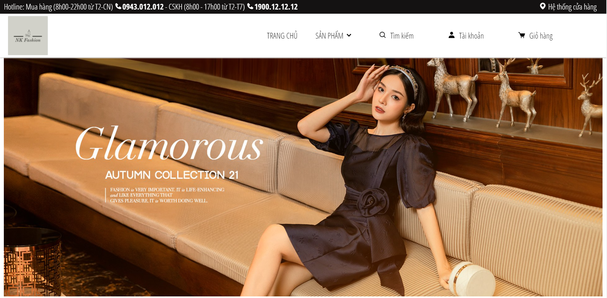
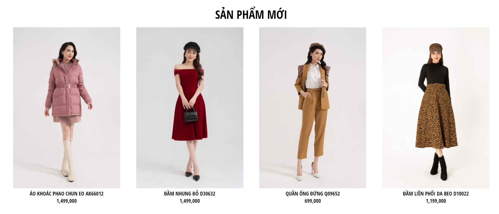
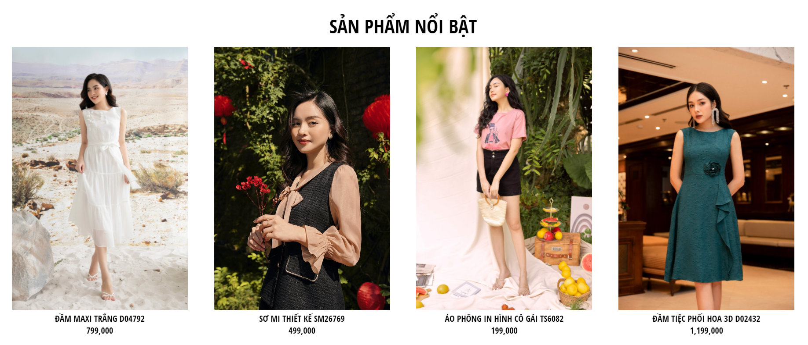
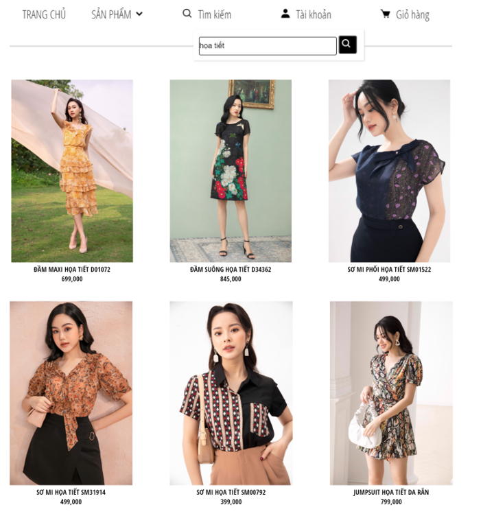
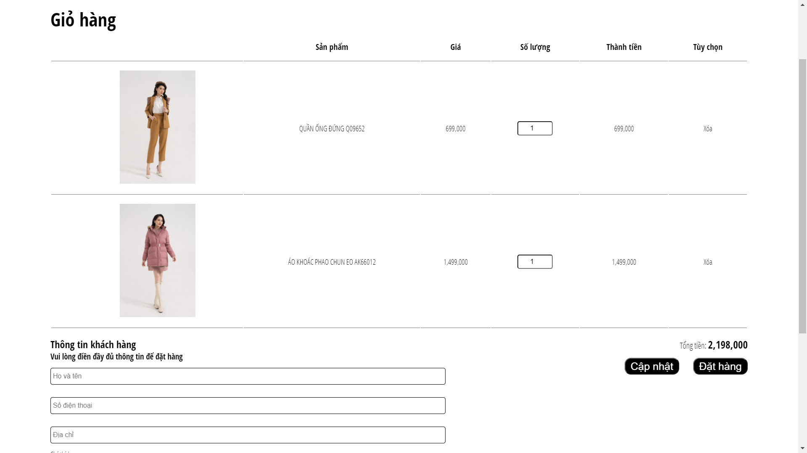
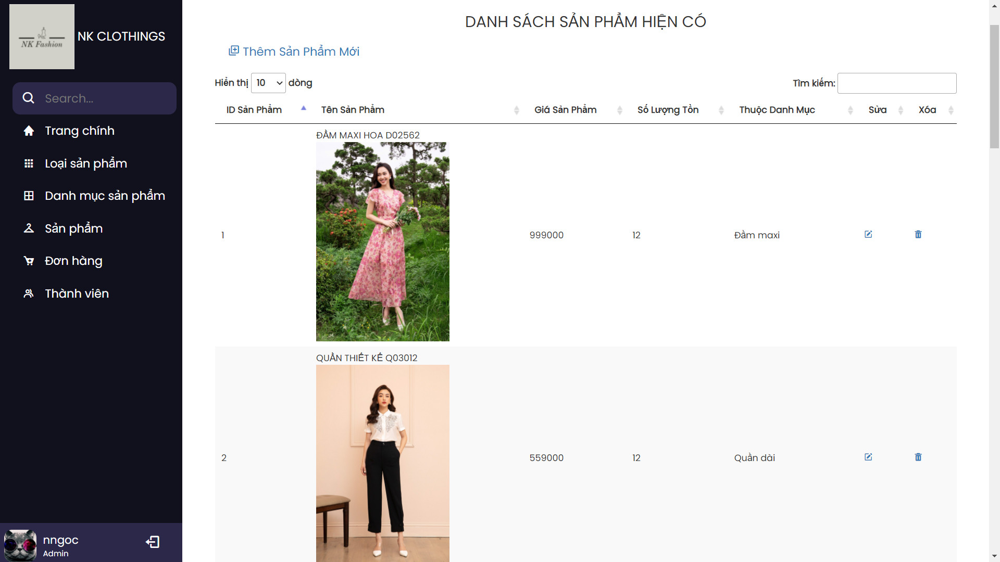
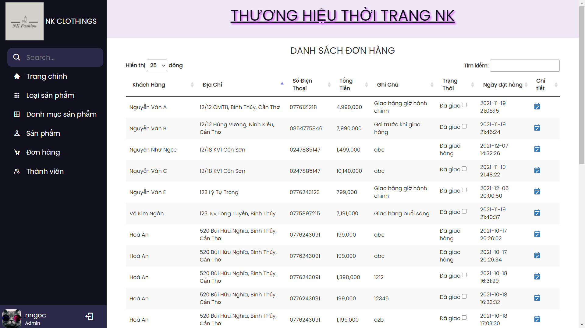
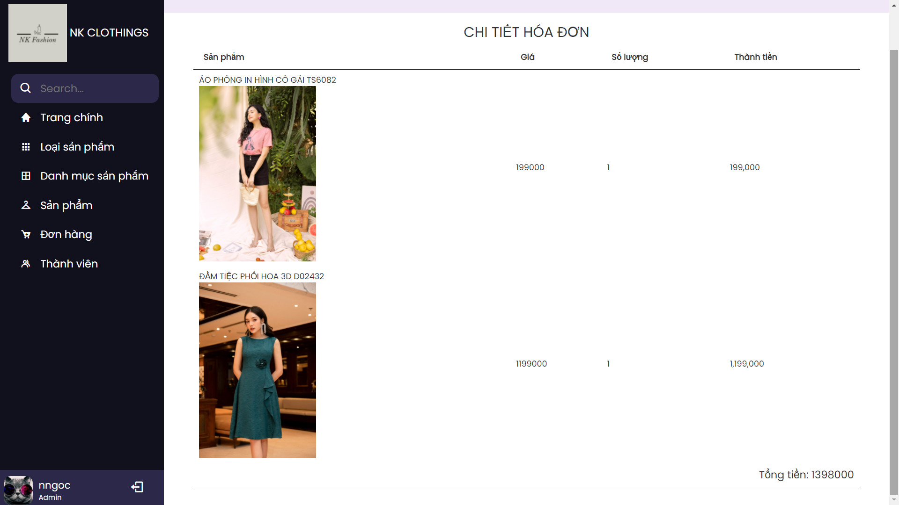

# Overview

This project is a web shop application.

## Description

In this project, I used Laravel to design, and develop a whole website. Besides that, I also use phpMyAdmin for the application database.

This is a semester essay I made in 2021.

## Contact

If you have any questions or feedback about this project, please feel free to contact me via:
- [Facebook](https://www.facebook.com/nhungocc1212/)
- [Linkedin](https://www.linkedin.com/in/nhungoc-nguyen-1a969b233/)
- [GitHub](https://github.com/nnhungoc1209)
- [GitLab](https://gitlab.com/nnhungoc1209)

## Project image

<i>Home page</i>
  

<i>Top the newest products</i>
  

<i>Top best seller products</i>
  

<i>Search feature for user to find the product that they want</i>

 

<i>User's cart</i>
 

<i>Admin's products management feature</i>
 

<i>Admin's orders management feature</i>
 

<i>Admin's orders detail viewing feature</i>

